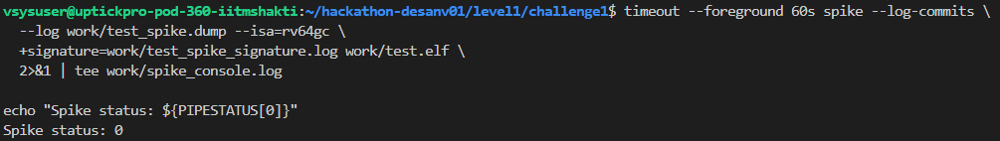
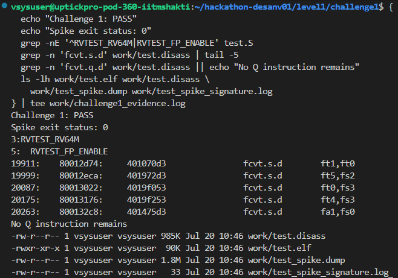

# Level 1 - Challenge 1

## What failed and why

The first assembler error was caused by this instruction:

~~~
fcvt.q.d f2, f3
~~~

The Makefile was using "-march=rv64gc". That includes the integer, multiply, atomic, floating-point single/double, and compressed extensions, but it does not include the quad-precision "Q" extension. Therefore fcvt.q.d could not be assembled.

After fixing that, the assembler found an immediate-value error:

~~~
addi a1, a0, 5000
~~~

"addi" has a signed 12-bit immediate, so its range is "-2048" to "2047". The value 5000 is outside that range.

The next error was a malformed load:

~~~
ld a0, tdat, 0(s0)
~~~

A load has one address operand in the form offset(base). Also, s0 had already been loaded with the address of tdat, so the extra label was not needed.

Once the assembler errors were gone, Spike still failed. The failure value at the end of the dump was related to 0x539, which is decimal 1337. That showed that the program was reaching the test harness's unexpected-exception path.

## How I fixed it

I replaced the unsupported quad-precision instruction with an operation supported by the selected ISA:

~~~
fcvt.s.d f2, f3
~~~

For the large immediate, I built the value in a register and then used a register-register add:

~~~
li   a1, 5000
add  a1, a0, a1
~~~

For the load, I used the address already held in s0:

~~~
ld   a0, 0(s0)
~~~

Finally, I changed the test setup so that it could legally access machine CSRs and use floating-point instructions:

~~~
RVTEST_RV64M
RVTEST_CODE_BEGIN
  RVTEST_FP_ENABLE
~~~

## Commands used to check it

~~~
cd ~/hackathon-desanv01/level1/challenge1

make clean
mkdir -p work
set -o pipefail

make compile 2>&1 | tee work/compile.log
echo "Compile status: ${PIPESTATUS[0]}"

make disass 2>&1 | tee work/disass.log
~~~

I then ran the corrected ELF on Spike with a timeout:

~~~
timeout --foreground 60s spike \
  --log-commits \
  --log work/test_spike.dump \
  --isa=rv64gc \
  +signature=work/test_spike_signature.log \
  work/test.elf \
  2>&1 | tee work/spike_console.log

status=${PIPESTATUS[0]}
echo "Spike status: $status"
~~~

I checked that the unsupported instruction was no longer present:

~~~
grep -n 'fcvt.q.d' work/test.disass || echo "PASS: no Q instruction"
grep -n 'fcvt.s.d' work/test.disass | tail -5
~~~

## Final result

The final run gave:

~~~
Compilation: PASS
Disassembly generation: PASS
Unsupported Q instruction remaining: NO
Spike status: 0
Challenge 1: PASS
~~~

## Evidence

The useful output files were:

~~~
work/compile.log
work/disass.log
work/test.elf
work/test.disass
work/test_spike.dump
work/test_spike_signature.log
work/spike_console.log
work/challenge1_evidence.log
~~~

