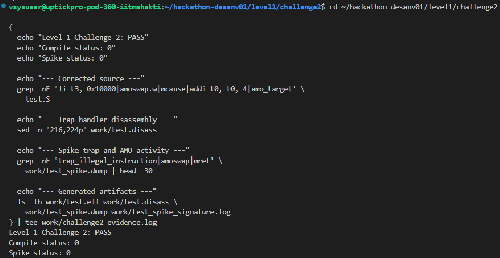
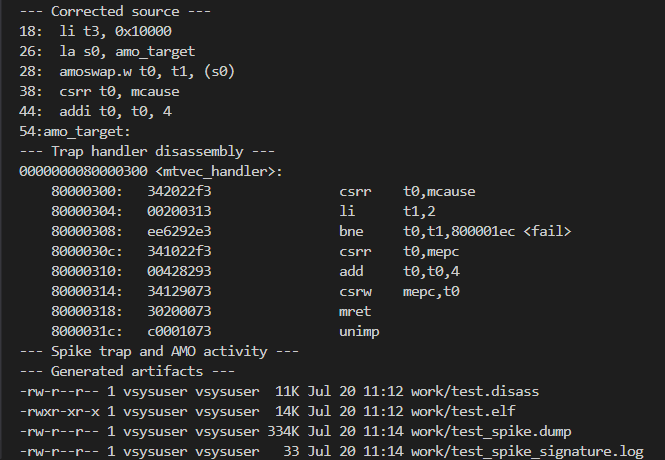
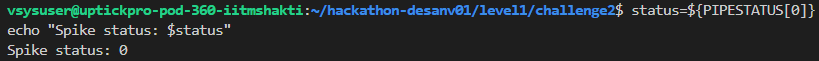
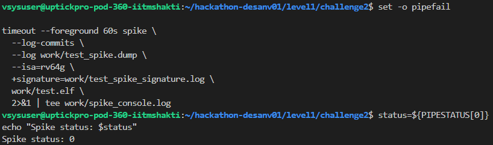

# Level 1 - Challenge 2

## What failed and why

The first source error was:

~~~
addi t2, t2, 0x10000
~~~

The immediate accepted by addi is only a signed 12-bit value. 0x10000 cannot be encoded directly.

The AMO instruction was also written as:

~~~
amoswap.w t0, t1, 4(s0)
~~~

An AMO uses a register address with no displacement.

The original test also did not set s0 to a known aligned writable address. That could have caused a separate memory exception.

There was a runtime problem in the illegal-instruction handler too. It read mcause, but then reused the same register for mepc without comparing mcause against the expected illegal-instruction cause. Also, it returned to the same illegal instruction because mepc was not advanced.

## How I fixed it

I built the large constant with register operations:

~~~
li  t2, 0
li  t3, 0x10000
add t2, t2, t3
~~~

I added an arithmetic check:

~~~
li  t5, 0x10001
sub t6, t5, t2
li  t4, 1
bne t6, t4, fail
~~~

For the atomic test, I added an aligned word in the data section:

~~~
.align 2
amo_target:
  .word 0
~~~

Then I loaded the address and used the correct AMO syntax:

~~~
la  s0, amo_target
li  t1, 0x12345678
amoswap.w t0, t1, (s0)
~~~

Because the original memory value was zero, I checked that the old value returned by the AMO was zero. I also loaded the word back and checked that the new value was stored correctly.

I also changed the trap handler to validate mcause and advance mepc by four bytes:

~~~
.align 8
.global mtvec_handler

mtvec_handler:
  csrr t0, mcause
  li   t1, CAUSE_ILLEGAL_INSTRUCTION
  bne  t0, t1, fail

  csrr t0, mepc
  addi t0, t0, 4
  csrw mepc, t0
  mret
~~~

The four-byte increment is correct here because the deliberate illegal value was emitted with ".word" and the source used ".option norvc".

## Commands used to check it

~~~
cd ~/hackathon-desanv01/level1/challenge2

make clean
mkdir -p work
set -o pipefail

make compile 2>&1 | tee work/compile.log
echo "Compile status: ${PIPESTATUS[0]}"

make disass 2>&1 | tee work/disass.log
echo "Disassembly status: ${PIPESTATUS[0]}"
~~~

I checked the important instructions in the disassembly:

~~~
grep -nE '<illegal_instruction>|<mtvec_handler>|amoswap|mcause|mepc|mret' \
  work/test.disass
~~~

Finally, I ran Spike:

~~~
timeout --foreground 60s spike \
  --log-commits \
  --log work/test_spike.dump \
  --isa=rv64g \
  +signature=work/test_spike_signature.log \
  work/test.elf \
  2>&1 | tee work/spike_console.log

status=${PIPESTATUS[0]}
echo "Spike status: $status"
~~~

## Final result

The final checks were:

~~~
Compilation: PASS
Disassembly generation: PASS
Illegal-instruction cause check: PASS
MEPC recovery: PASS
AMO addressing and result checks: PASS
Spike status: 0
Level 1 Challenge 2: PASS
~~~

The main issue I encountered was that there were both assembly-level errors and a trap-recovery error. The AMO syntax and address had to be corrected, but that alone was not enough. The handler also had to verify the exception and skip past the illegal instruction.

## Evidence

The relevant files were:

~~~
work/compile.log
work/disass.log
work/test.elf
work/test.disass
work/test_spike.dump
work/test_spike_signature.log
work/spike_console.log
work/challenge2_evidence.log
~~~

