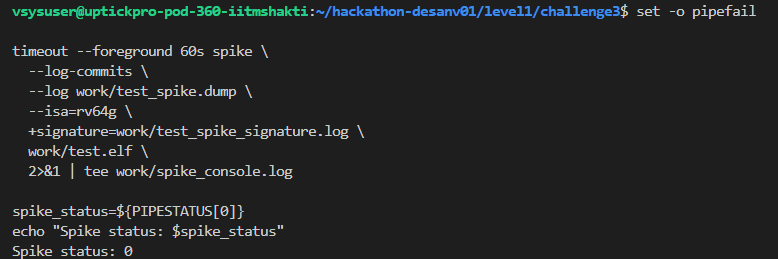
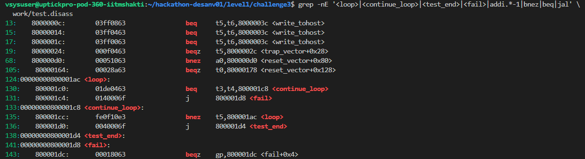
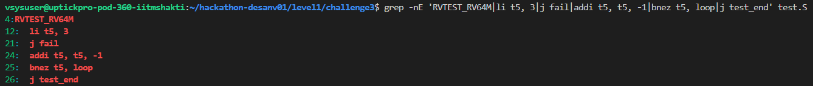

# Level 1 - Challenge 3

## What failed and why

The original loop loaded the count as three, but then increased it:

~~~
li t5, 3

continue_loop:
  addi t5, t5, 1
  bgtz t5, loop
~~~

Since t5 stayed positive and kept growing, the loop did not finish after the three records. It continued reading beyond the test table and started treating unrelated memory as operands.

The comparison had a separate problem. When the calculated result was wrong, the code fell through to the next loop step instead of jumping to fail. That could hide an arithmetic error.

There was also an architecture mismatch. The source was declared as an RV32 machine-mode test while the Makefile was building an RV64 program.

## How I fixed it

I changed the test declaration to match the RV64 build:

~~~
RVTEST_RV64M
~~~

The result comparison now sends a wrong result to fail:

~~~
beq t3, t4, continue_loop
j fail
~~~

The counter is decremented after each successful record and the test ends when it reaches zero:

~~~
continue_loop:
  addi t5, t5, -1
  bnez t5, loop
  j test_end
~~~

This makes the loop bounded to exactly three iterations.

The records checked by the test were:

~~~
0x00000020 + 0x00000020 = 0x00000040
0x03034078 + 0x5d70344d = 0x607374c5
0x0000cafe + 0x00000001 = 0x0000caff
~~~

## Commands used to check it

~~~
cd ~/hackathon-desanv01/level1/challenge3

make clean
mkdir -p work
set -o pipefail

make compile 2>&1 | tee work/compile.log
compile_status=${PIPESTATUS[0]}
echo "Compile status: $compile_status"

make disass 2>&1 | tee work/disass.log
disass_status=${PIPESTATUS[0]}
echo "Disassembly status: $disass_status"
~~~

I inspected the corrected source and its generated branches:

~~~
grep -nE 'RVTEST_RV64M|li t5, 3|j fail|addi t5, t5, -1|bnez t5, loop|j test_end' test.S

grep -nE '<loop>|<continue_loop>|<test_end>|<fail>|addi.*-1|bnez|beq|jal' \
  work/test.disass
~~~

Then I ran the test on Spike:

~~~
timeout --foreground 60s spike \
  --log-commits \
  --log work/test_spike.dump \
  --isa=rv64g \
  +signature=work/test_spike_signature.log \
  work/test.elf \
  2>&1 | tee work/spike_console.log

spike_status=${PIPESTATUS[0]}
echo "Spike status: $spike_status"
~~~

## Final result

The observed result was:

~~~
Compile status: 0
Disassembly status: 0
Spike status: 0
Level 1 Challenge 3: PASS
~~~

## Evidence

~~~
work/compile.log
work/disass.log
work/spike_console.log
work/test.elf
work/test.disass
work/test_spike.dump
work/test_spike_signature.log
~~~

