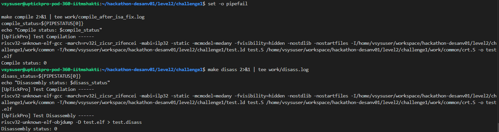
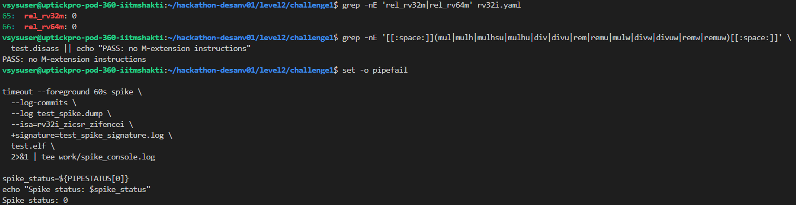
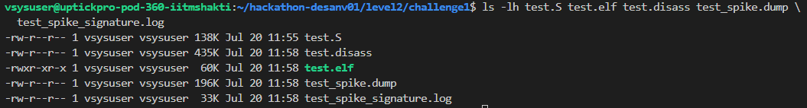

# Level 2 - Challenge 1

## What failed and why

The YAML was configured for RV32, but it still gave a nonzero weight to the RV64M instruction group:

~~~
rel_rv32m: 0
rel_rv64m: 10
~~~

AAPG was generating an RV32 program, while the configuration allowed it to choose RV64 multiply and divide instructions. That was an architecture mismatch.

The intended instruction groups were the RV32I groups:

~~~
rel_rv32i.compute: 10
rel_rv32i.data: 10
rel_rv32i.fence: 10
~~~

After disabling the RV64M distribution and regenerating the program, a different build error appeared. The assembler reported that CSR instructions needed Zicsr and that fence.i needed Zifencei. These instructions were also used by the AAPG runtime files under work/common.

So there were two separate issues:

1. The YAML enabled an incompatible RV64M distribution.
2. The Makefile architecture string did not explicitly include the extensions required by the generated runtime and fence instructions.

## How I fixed it

I disabled both multiply/divide distributions for this RV32I test:

~~~
rel_rv32m: 0
rel_rv64m: 0
~~~

I kept the intended RV32I groups enabled.

I then changed the compiler architecture in the Makefile from:

~~~
-march=rv32i
~~~

to:

~~~
-march=rv32i_zicsr_zifencei
~~~

I also changed the Spike ISA to the same value:

~~~
--isa=rv32i_zicsr_zifencei
~~~

## Commands used to check it

I regenerated the AAPG program and saved the generator output:

~~~
cd ~/hackathon-desanv01/level2/challenge1

GEN_LOG=$(mktemp)
set -o pipefail

make gen 2>&1 | tee "$GEN_LOG"
gen_status=${PIPESTATUS[0]}

cp "$GEN_LOG" work/generation.log
echo "Generation status: $gen_status"
~~~

Then I compiled and generated the disassembly:

~~~
make compile 2>&1 | tee work/compile_after_isa_fix.log
compile_status=${PIPESTATUS[0]}
echo "Compile status: $compile_status"

make disass 2>&1 | tee work/disass.log
disass_status=${PIPESTATUS[0]}
echo "Disassembly status: $disass_status"
~~~

I checked the disassembly to confirm that no M-extension instructions were generated:

~~~
grep -nE '[[:space:]](mul|mulh|mulhsu|mulhu|div|divu|rem|remu|mulw|divw|divuw|remw|remuw)[[:space:]]' \
  test.disass || echo "PASS: no M-extension instructions"
~~~

Finally, I ran the program on Spike:

~~~
timeout --foreground 60s spike \
  --log-commits \
  --log test_spike.dump \
  --isa=rv32i_zicsr_zifencei \
  +signature=test_spike_signature.log \
  test.elf \
  2>&1 | tee work/spike_console.log

spike_status=${PIPESTATUS[0]}
echo "Spike status: $spike_status"
~~~

## Final result

The successful run produced:

~~~
Generation status: 0
Compile status: 0
Disassembly status: 0
Spike status: 0
PASS: no M-extension instructions
~~~

The main thing I learned from this challenge was that changing the YAML alone was not enough. The generated program, the runtime support files, the compiler flags, and the Spike ISA all have to describe compatible machines.

## Evidence

The useful files were:

~~~
work/generation.log
work/compile_before_isa_fix.log
work/compile_after_isa_fix.log
work/disass.log
work/spike_console.log
test.S
test.elf
test.disass
test_spike.dump
test_spike_signature.log
~~~

