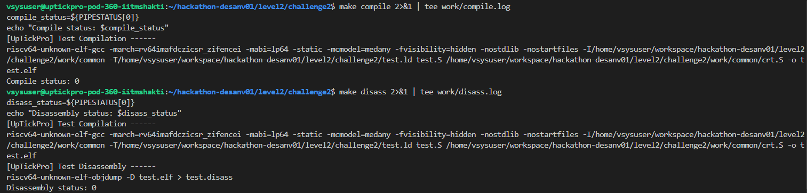
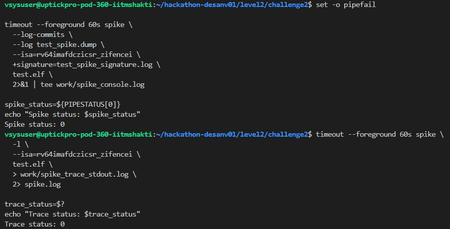
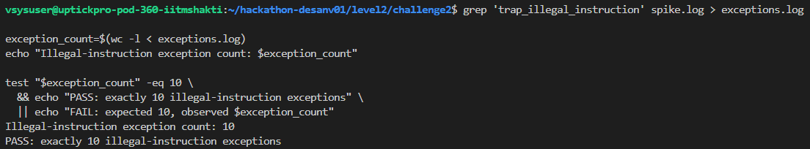
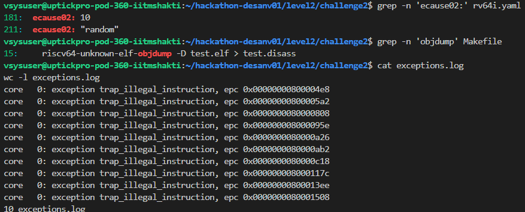

# Level 2 Challenge 2 Submission

## Challenge Objective

The purpose of this challenge was to configure AAPG to generate an RV64 test containing exactly ten illegal-instruction exceptions. The generated test then had to be compiled, disassembled, executed on Spike, and checked by counting the illegal-instruction trap entries.

## Problem Observed

The supplied configuration did not enable any exception generation. All exception causes had a value of zero, including cause 2:

```yaml
exception-generation:
  ecause00: 0
  ecause01: 0
  ecause02: 0
  ecause03: 0
```

The challenge specifically required ten illegal-instruction exceptions, but the configuration requested zero.

A separate architecture mismatch was also found in the Makefile. The program was generated and compiled for RV64, but the disassembly command used the RV32 objdump tool:

```make
riscv32-unknown-elf-objdump -D test.elf
```

## Root Cause

In RISC-V, synchronous exception cause 2 represents an illegal instruction. AAPG uses the `ecause02` configuration value to control generation of this exception type.

Because `ecause02` was set to zero, AAPG had no request to insert illegal instructions into the generated program.

The disassembly problem was caused by using a 32-bit objdump executable for an ELF created by the RV64 compiler. Even if some toolchain installations can read both formats, the correct architecture-specific tool should be used to avoid inconsistent or unsupported output.

## Fix Applied

The illegal-instruction exception count was changed from zero to ten:

```yaml
exception-generation:
  ecause00: 0
  ecause01: 0
  ecause02: 10
  ecause03: 0
```

All other exception causes remained disabled so that the test focused specifically on illegal-instruction handling.

The disassembly command was corrected to use the RV64 tool:

```make
riscv64-unknown-elf-objdump -D test.elf > test.disass
```

## AAPG Generation

The corrected configuration was used to generate the assembly program:

```bash
GEN_LOG=$(mktemp)
set -o pipefail

make gen 2>&1 | tee "$GEN_LOG"
gen_status=${PIPESTATUS[0]}

cp "$GEN_LOG" work/generation.log
echo "Generation status: $gen_status"
```

The generation completed successfully:

```text
Generation status: 0
```

AAPG produced the required files, including:

```text
test.S
test.ld
work/common/crt.S
```

## Compilation

The generated RV64 assembly was compiled with:

```bash
make compile 2>&1 | tee work/compile.log
compile_status=${PIPESTATUS[0]}
echo "Compile status: $compile_status"
```

The observed result was:

```text
Compile status: 0
```

No additional compilation errors were encountered.

## Disassembly

The RV64 disassembly was generated with:

```bash
make disass 2>&1 | tee work/disass.log
disass_status=${PIPESTATUS[0]}
echo "Disassembly status: $disass_status"
```

The observed result was:

```text
Disassembly status: 0
```

The ELF architecture was checked with:

```bash
riscv64-unknown-elf-readelf -h test.elf | grep -E 'Class:|Machine:'
```

The output confirmed:

```text
Class: ELF64
Machine: RISC-V
```

This verified that the corrected RV64 objdump tool matched the generated executable.

## Spike Execution

The program was executed on Spike with a 60-second timeout:

```bash
set -o pipefail

timeout --foreground 60s spike \
  --log-commits \
  --log test_spike.dump \
  --isa=rv64imafdczicsr_zifencei \
  +signature=test_spike_signature.log \
  test.elf \
  2>&1 | tee work/spike_console.log

spike_status=${PIPESTATUS[0]}
echo "Spike status: $spike_status"
```

The observed result was:

```text
Spike status: 0
```

This showed that the generated illegal instructions were handled by the test environment and that execution completed successfully.

## Illegal-Instruction Trace

A full Spike instruction trace was generated using:

```bash
timeout --foreground 60s spike \
  -l \
  --isa=rv64imafdczicsr_zifencei \
  test.elf \
  > work/spike_trace_stdout.log \
  2> spike.log

trace_status=$?
echo "Trace status: $trace_status"
```

The trace completed successfully:

```text
Trace status: 0
```

The illegal-instruction handler entries were extracted and counted:

```bash
grep 'trap_illegal_instruction' spike.log > exceptions.log

exception_count=$(wc -l < exceptions.log)
echo "Illegal-instruction exception count: $exception_count"

test "$exception_count" -eq 10 \
  && echo "PASS: exactly 10 illegal-instruction exceptions" \
  || echo "FAIL: expected 10, observed $exception_count"
```

The final result was:

```text
Illegal-instruction exception count: 10
PASS: exactly 10 illegal-instruction exceptions
```

## Evidence Captured

The corrected exception setting was recorded using:

```bash
grep -n 'ecause02:' rv64i.yaml
```

The corrected disassembly tool was confirmed using:

```bash
grep -n 'objdump' Makefile
```

The exception entries and final count were preserved in:

```text
spike.log
exceptions.log
```

The main generated artifacts were:

```text
test.S
test.elf
test.disass
test_spike.dump
test_spike_signature.log
work/generation.log
work/compile.log
work/disass.log
work/spike_console.log
work/spike_trace_stdout.log
spike.log
exceptions.log
```

## Final Result

Two issues were corrected:

1. Illegal-instruction exception generation was disabled because `ecause02` was zero.
2. The Makefile used the RV32 objdump tool for an RV64 executable.

After applying the fixes, the complete flow produced:

```text
Generation status: 0
Compile status: 0
Disassembly status: 0
Spike status: 0
Trace status: 0
Illegal-instruction exception count: 10
PASS: exactly 10 illegal-instruction exceptions
```

The generated RV64 program now contains exactly ten illegal-instruction exceptions, handles them successfully, and completes correctly on Spike.






