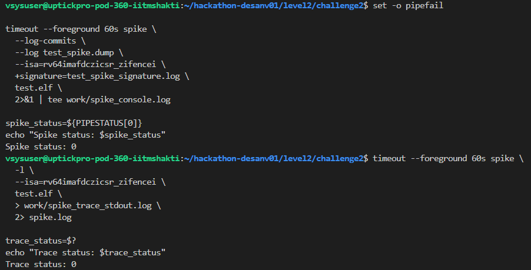
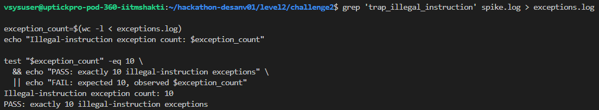
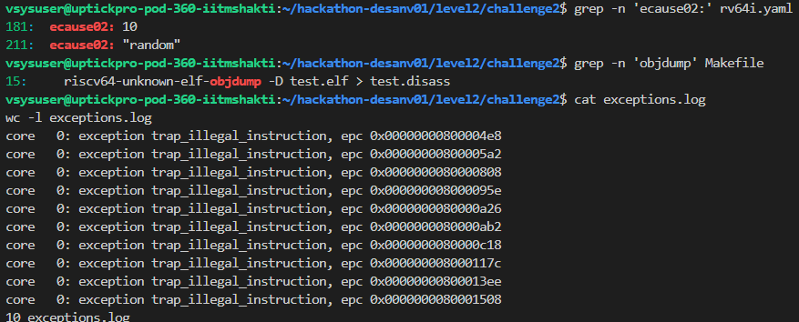

# Level 2 - Challenge 2

## What failed and why

The supplied YAML did not request any exceptions. All the exception weights were zero:

~~~
exception-generation:
  ecause00: 0
  ecause01: 0
  ecause02: 0
  ecause03: 0
~~~

Cause 2 is the RISC-V cause for an illegal instruction. Since ecause02 was zero, AAPG had no reason to generate illegal instructions. The resulting program could not satisfy the requirement of ten illegal-instruction exceptions.

There was also an architecture mismatch in the Makefile. The test was generated as RV64, but the disassembly command used the RV32 objdump tool:

~~~
riscv32-unknown-elf-objdump -D test.elf
~~~

That's the wrong tool for an RV64 ELF.

## How I fixed it

I enabled exactly ten illegal-instruction exceptions and kept the other exception causes disabled:

~~~
exception-generation:
  ecause00: 0
  ecause01: 0
  ecause02: 10
  ecause03: 0
~~~

I also changed the disassembly command to use the RV64 tool:

~~~
riscv64-unknown-elf-objdump -D test.elf > test.disass
~~~

This made the AAPG exception setting and the toolchain architecture consistent with the RV64 test.

## Commands used to check it

I regenerated the program first:

~~~
cd ~/hackathon-desanv01/level2/challenge2

GEN_LOG=$(mktemp)
set -o pipefail

make gen 2>&1 | tee "$GEN_LOG"
gen_status=${PIPESTATUS[0]}

cp "$GEN_LOG" work/generation.log
echo "Generation status: $gen_status"
~~~

Then I compiled and disassembled it:

~~~
make compile 2>&1 | tee work/compile.log
compile_status=${PIPESTATUS[0]}
echo "Compile status: $compile_status"

make disass 2>&1 | tee work/disass.log
disass_status=${PIPESTATUS[0]}
echo "Disassembly status: $disass_status"
~~~

I checked that the ELF really was RV64:

~~~
riscv64-unknown-elf-readelf -h test.elf | grep -E 'Class:|Machine:'
~~~

The output confirmed:

~~~
Class: ELF64
Machine: RISC-V
~~~

I ran the program on Spike:

~~~
timeout --foreground 60s spike \
  --log-commits \
  --log test_spike.dump \
  --isa=rv64imafdczicsr_zifencei \
  +signature=test_spike_signature.log \
  test.elf \
  2>&1 | tee work/spike_console.log

spike_status=${PIPESTATUS[0]}
echo "Spike status: $spike_status"
~~~

To count the illegal-instruction traps, I generated a full Spike trace:

~~~
timeout --foreground 60s spike \
  -l \
  --isa=rv64imafdczicsr_zifencei \
  test.elf \
  > work/spike_trace_stdout.log \
  2> spike.log

trace_status=$?
echo "Trace status: $trace_status"

grep 'trap_illegal_instruction' spike.log > exceptions.log

exception_count=$(wc -l < exceptions.log)
echo "Illegal-instruction exception count: $exception_count"

test "$exception_count" -eq 10 \
  && echo "PASS: exactly 10 illegal-instruction exceptions" \
  || echo "FAIL: expected 10, observed $exception_count"
~~~

## Final result

The corrected flow produced:

~~~
Generation status: 0
Compile status: 0
Disassembly status: 0
Spike status: 0
Trace status: 0
Illegal-instruction exception count: 10
PASS: exactly 10 illegal-instruction exceptions
~~~

The two bugs were independent. The YAML had disabled the exception generation, and the Makefile used an RV32 disassembler for an RV64 executable. Both had to be corrected before the final results can be generated.

## Evidence files

~~~
test.S
test.elf
test.disass
test_spike.dump
test_spike_signature.log
work/generation.log
work/compile.log
work/disass.log
work/spike_console.log
work/spike_trace_stdout.log
spike.log
exceptions.log
~~~

