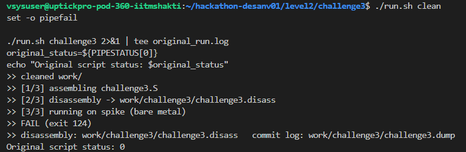
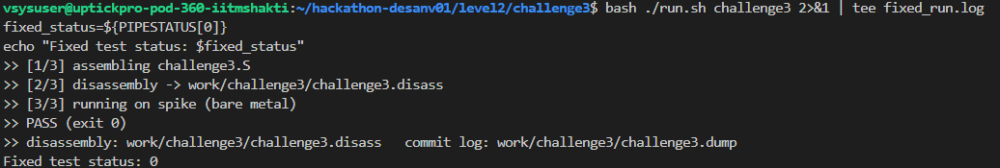
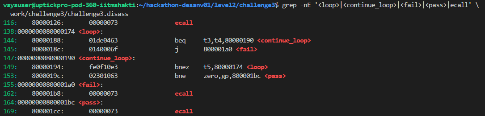
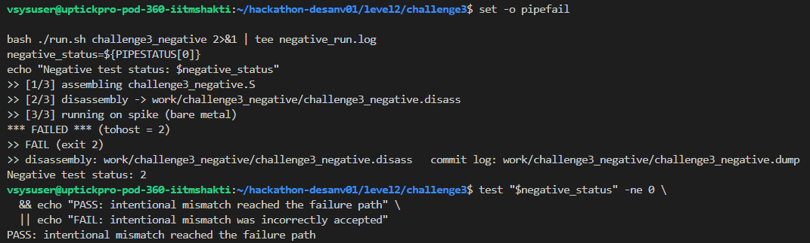
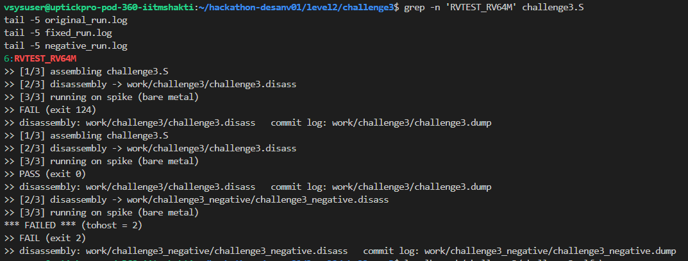

# Level 2 - Challenge 3

## What failed and why

The original RVTEST_PASS returned a nonzero value:

~~~
#define RVTEST_PASS
        fence
1:      beqz TESTNUM, 1b
        sll TESTNUM, TESTNUM, 1
        or TESTNUM, TESTNUM, 1
        li a7, 93
        addi a0, TESTNUM, 0
        ecall
~~~

That is failure-style behavior because it encodes TESTNUM into the exit result.

At the same time, RVTEST_FAIL returned zero:

~~~
#define RVTEST_FAIL
        fence
        li TESTNUM, 1
        li a7, 93
        li a0, 0
        ecall
~~~

So the pass and fail macros were effectively reversed.

There was also an architecture mismatch. The assembly declared:

~~~
RVTEST_RV32M
~~~

but run.sh compiled and ran the program as RV64:

~~~
-march=rv64imafdczicsr_zifencei
~~~

The runner had one more problem. It printed Spike's result, but did not return the same status to the shell.

The three arithmetic records themselves were correct:

~~~
0x20 + 0x20 = 0x40
0x03034078 + 0x5d70344d = 0x607374c5
0xcafe + 0x1 = 0xcaff
~~~

## How I fixed it

I restored the pass macro so that it exits with zero:

~~~
#define RVTEST_PASS
        fence
        li TESTNUM, 1
        li a7, 93
        li a0, 0
        ecall
~~~

I restored the failure behavior so that it returns a nonzero test result:

~~~
#define RVTEST_FAIL
        fence
1:      beqz TESTNUM, 1b
        sll TESTNUM, TESTNUM, 1
        or TESTNUM, TESTNUM, 1
        li a7, 93
        addi a0, TESTNUM, 0
        ecall
~~~

I changed the assembly declaration to match the RV64 compiler and Spike configuration:

~~~
RVTEST_RV64M
~~~

Finally, I added this to the end of run.sh:

~~~
exit "$rc"
~~~

That made the runner propagate Spike's actual status instead of returning the status of the final echo command.

## Original failure check

I saved copies of the original files before changing them:

~~~
mkdir -p original_files work
cp -n challenge3.S riscv_test.h run.sh original_files/
chmod +x run.sh

./run.sh clean
set -o pipefail

./run.sh challenge3 2>&1 | tee original_run.log
original_status=${PIPESTATUS[0]}
echo "Original script status: $original_status"
~~~

The original run reported failure even though the three additions were correct.

## Corrected positive test

~~~
chmod +x run.sh
mkdir -p work
./run.sh clean
set -o pipefail

./run.sh challenge3 2>&1 | tee fixed_run.log
fixed_status=${PIPESTATUS[0]}
echo "Fixed test status: $fixed_status"
~~~

The corrected positive test produced:

~~~
>> PASS (exit 0)
Fixed test status: 0
~~~

## Intentional negative test

I copied the corrected test and changed the first expected result from 0x40 to 0x41:

~~~
cp challenge3.S challenge3_negative.S

sed -i '0,/\.word 0x40/{s/\.word 0x40/.word 0x41/}' \
  challenge3_negative.S

set -o pipefail
./run.sh challenge3_negative 2>&1 | tee negative_run.log
negative_status=${PIPESTATUS[0]}
echo "Negative test status: $negative_status"

test "$negative_status" -ne 0 \
  && echo "PASS: intentional mismatch reached the failure path" \
  || echo "FAIL: intentional mismatch was incorrectly accepted"
~~~

The result was:

~~~
PASS: intentional mismatch reached the failure path
~~~

## Disassembly and evidence checks

I inspected the generated control-flow instructions:

~~~
grep -nE '<loop>|<continue_loop>|<fail>|<pass>|ecall' \
  work/challenge3/challenge3.disass
~~~

I compared the original and corrected harness:

~~~
diff -u original_files/riscv_test.h riscv_test.h
grep -n 'RVTEST_RV64M' challenge3.S
~~~

The important output files were:

~~~
original_run.log
fixed_run.log
negative_run.log
work/challenge3/
work/challenge3_negative/
~~~

## Final result

After the corrections:

~~~
Positive test: PASS
Fixed test status: 0
Intentional negative test: FAIL as expected
Negative test status: nonzero
~~~

