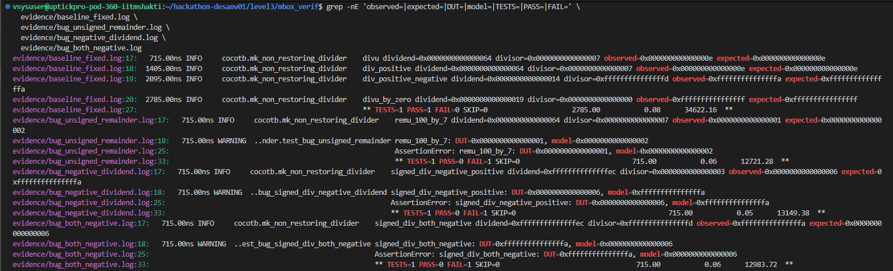
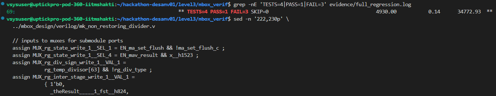
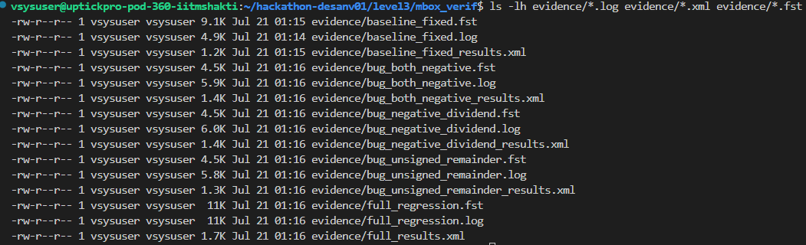
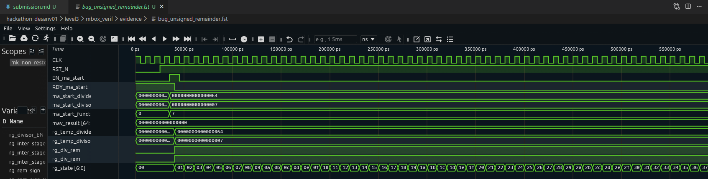
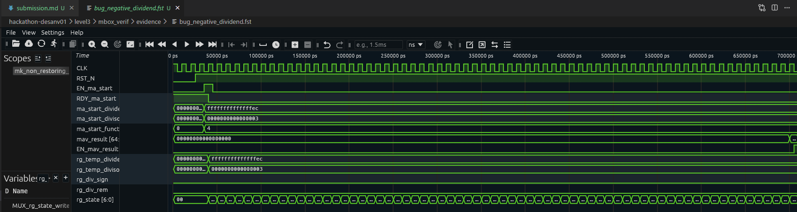
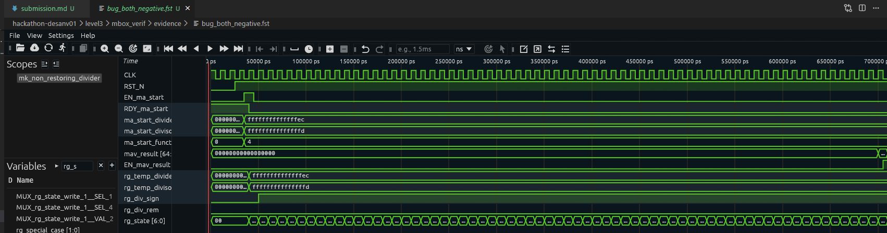
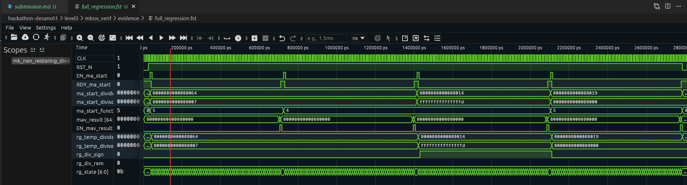

# Level 3 - Divider Verification

## Problems in the original testbench

The testbench was described as a signed-division test, but it used:

~~~
funct3 = 5
~~~

For the RISC-V operation encoding used here, funct3 5 selects unsigned division, not signed DIV. The random values were also nonnegative:

~~~
A = random.randrange(0, 500)
B = random.randrange(0, 50)
~~~

That meant the test could not exercise negative dividends or negative divisors.

The original test used only positive operands and had handshake issues. It did not wait for ready, pulse start correctly, check the valid bit, consume results, or use a timeout.
I fixed the driver and added a reference model for DIV, DIVU, REM, and REMU, including signed and word operations.

## Baseline check

Before testing the suspected bugs, I ran a baseline test. It passed:

~~~
TESTS=1 PASS=1 FAIL=0
Baseline status: 0
~~~

Then, I used this commands:

~~~
cd ~/hackathon-desanv01/level3/mbox_verif

make clean
set -o pipefail

COCOTB_TEST_FILTER='.*test_divider_baseline$' \
make SIM=icarus WAVES=1 2>&1 | tee evidence/baseline_fixed.log

baseline_status=${PIPESTATUS[0]}
echo "Baseline status: $baseline_status"
~~~

## Bug 1 - Incorrect unsigned remainder

### Test

~~~
Operation: REMU
Dividend: 100
Divisor:  7
~~~

The reference model calculated:

~~~
100 % 7 = 2
Model = 0x0000000000000002
~~~

The DUT returned:

~~~
DUT = 0x0000000000000001
~~~

The test was run with:

~~~
COCOTB_TEST_FILTER='.*test_bug_unsigned_remainder$' \
make SIM=icarus WAVES=1
~~~

DIVU with the same operands passed in the baseline, so the request and operand delivery were working. The mismatch was specific to the unsigned remainder result path. The DUT appeared to produce an incorrect final remainder or remainder correction for this input.

I left the RTL unchanged.

## Bug 2 - Wrong signed quotient sign

The divider RTL contained this sign expression:

~~~
assign MUX_rg_div_sign_write_1__VAL_1 =
         rg_temp_divisor[63] && !rg_div_type;
~~~

For signed division, the quotient is negative when exactly one operand is negative. The expected sign is therefore:

~~~
dividend_sign XOR divisor_sign
~~~

The RTL expression used only the divisor sign.

### Test 2A - Negative dividend and positive divisor

~~~
Operation: DIV
Dividend: -20
Divisor:   3
~~~

The RISC-V signed result truncates toward zero:

~~~
-20 / 3 = -6
Expected = 0xfffffffffffffffa
DUT      = 0x0000000000000006
~~~

The DUT returned a positive quotient because the divisor was positive and the dividend sign was ignored.

### Test 2B - Both operands negative

~~~
Operation: DIV
Dividend: -20
Divisor:  -3
~~~

The correct result is positive:

~~~
-20 / -3 = 6
Expected = 0x0000000000000006
DUT      = 0xfffffffffffffffa
~~~

Here the DUT returned a negative result because it treated the negative divisor as enough to make the quotient negative. It did not account for the negative dividend cancelling that sign.

## Full regression

The complete regression contained one passing baseline and three tests designed to fail when the DUT mismatched the model:

~~~
1 passing baseline test
1 failing REMU test
2 failing signed-DIV tests
~~~

I ran it with:

~~~
make clean
set -o pipefail

make SIM=icarus WAVES=1 2>&1 | tee evidence/full_regression.log

full_status=${PIPESTATUS[0]}
echo "Full regression status: $full_status"
~~~

The expected Cocotb summary was:

~~~
TESTS=4 PASS=1 FAIL=3
~~~

## Waveform checks

The waveforms were opened in Surfer. I checked the request, handshake, result, and internal divider signals:

~~~
CLK
RST_N
EN_ma_start
RDY_ma_start
ma_start_dividend
ma_start_divisor
ma_start_funct3
mav_result
EN_mav_result
rg_temp_dividend
rg_temp_divisor
rg_div_sign
rg_div_rem
rg_state
~~~

mav_result[64] is the result-valid bit, and mav_result[63:0] contains the quotient or remainder.

## Final result

The verification setup was corrected and two RTL bug categories were captured:

1. The unsigned remainder path returned 1 instead of 2 for 100 REMU 7.
2. The signed quotient sign used only the divisor sign instead of the signs of both operands.

## Evidence

~~~
evidence/baseline_fixed.log
evidence/baseline_fixed_results.xml
evidence/baseline_fixed.fst
evidence/bug_unsigned_remainder.log
evidence/bug_unsigned_remainder_results.xml
evidence/bug_unsigned_remainder.fst
evidence/bug_negative_dividend.log
evidence/bug_negative_dividend_results.xml
evidence/bug_negative_dividend.fst
evidence/bug_both_negative.log
evidence/bug_both_negative_results.xml
evidence/bug_both_negative.fst
evidence/full_regression.log
evidence/full_results.xml
evidence/full_regression.fst
~~~

