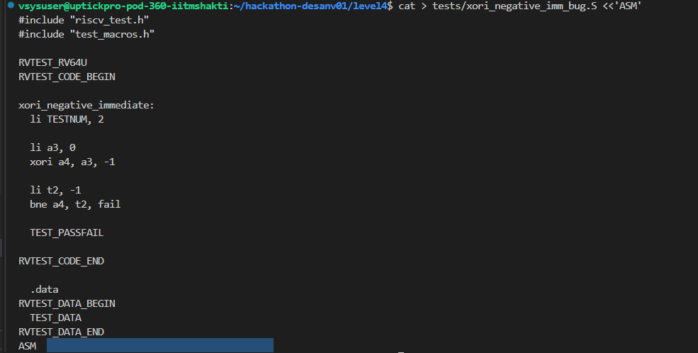
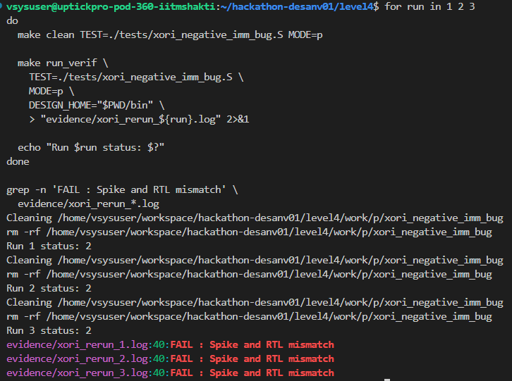
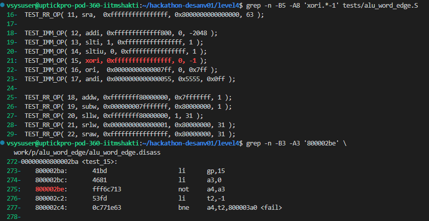
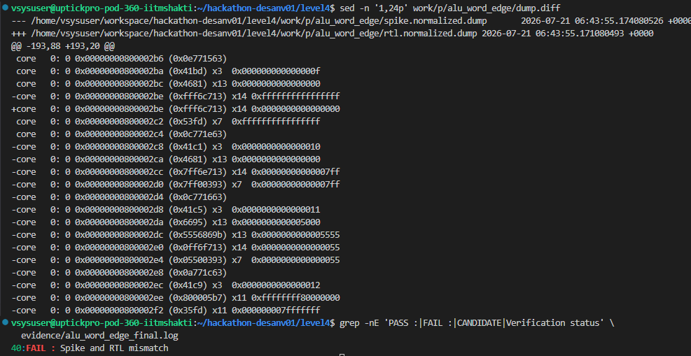

# Level 4: Capturing a Bug in the Shakti C-Class Processor

## Bug 1: Incorrect Result for XORI With a Negative Immediate

### Test Created

For Level 4, I used an assembly test named `alu_word_edge.S`. The test contains several RV64 integer edge cases, including immediate logical instructions and 32-bit word operations.

The test case that exposed the bug was:

```asm
li a3, 0
xori a4, a3, -1

li t2, -1
bne a4, t2, fail
```

## Expected Result

In RISC-V, the immediate used by `XORI` is sign-extended to the current XLEN.

For RV64:

```text
-1 sign-extended to 64 bits = 0xffffffffffffffff
```

The expected operation is:

```text
0x0000000000000000
XOR
0xffffffffffffffff
=
0xffffffffffffffff
```

Spike produced the expected result:

```text
x14 = 0xffffffffffffffff
```

## Observed RTL Result

The supplied C-Class RTL produced:

```text
x14 = 0x0000000000000000
```

The first difference appeared at PC `0x800002be`, with instruction encoding `0xfff6c713`.

```text
Spike:
core 0: 0x00000000800002be (0xfff6c713)
x14 0xffffffffffffffff

RTL:
core 0: 0x00000000800002be (0xfff6c713)
x14 0x0000000000000000
```

Because the RTL result was incorrect, the following comparison branch entered the test failure path. Most of the later lines in `dump.diff` were caused by this different control flow. Therefore, I treated the incorrect value written to `x14` as the first actual processor bug.

## How I Found It

I first ran a small baseline addition test using the supplied Level 4 binary. Spike and RTL matched, confirming that assembly compilation, Spike execution, RTL execution and dump comparison were working.

The first attempt to use the supplied binary stopped with:

```text
bin/out is missing or not executable
```

The binary had been extracted from `bin.zip`, but it did not have executable permission. I corrected that using:

```bash
chmod 755 bin/out
```

I then verified that the supplied DUT was available:

```bash
test -x bin/out && echo "PASS: supplied DUT is executable"
sha256sum bin/out
```

The SHA-256 value of the supplied binary was:

```text
54584ecb189646b95031b7df92e756a938b3390dc873a634efeee211ae05b337
```

After fixing the executable permission, the baseline test completed successfully:

```text
PASS : Spike and RTL match
VERIFICATION COMPLETED SUCCESSFULLY
```

I then ran the larger directed suite in physical and virtual modes. The baseline passed, but `alu_word_edge.S` produced:

```text
FAIL : Spike and RTL mismatch
CANDIDATE RTL MISMATCH: p/alu_word_edge
```

The suite returned status 1. In this case, the nonzero status was expected because Level 4 required a test that makes the faulty DUT differ from Spike.

## My Interpretation

The supplied C-Class processor does not correctly execute this `XORI` case when the immediate is `-1`.

The architectural reference model sign-extends the immediate and returns all ones. The RTL instead returns zero. This points to a problem in the handling, decoding or ALU execution of a negative immediate for `XORI`.

Only the compiled C-Class processor binary was supplied, so I did not modify or repair the processor implementation. The objective was to expose the bug using a reproducible assembly test, compare the result against Spike and identify the first architectural difference.

## Verification Commands

The following commands were used to reproduce the mismatch:

```bash
cd ~/hackathon-desanv01/level4

export DESIGN_HOME="$PWD/bin"

make clean TEST=./tests/alu_word_edge.S MODE=p

set -o pipefail

make run_verif \
  TEST=./tests/alu_word_edge.S \
  MODE=p \
  DESIGN_HOME="$PWD/bin" \
  2>&1 | tee evidence/alu_word_edge_final.log

echo "Verification status: ${PIPESTATUS[0]}"
```

The relevant test case was displayed using:

```bash
grep -n -B5 -A8 'xori.*-1' tests/alu_word_edge.S
```

The failing instruction was located in the disassembly using:

```bash
grep -n -B3 -A3 '800002be' \
  work/p/alu_word_edge/alu_word_edge.disass
```

The first architectural mismatch was displayed using:

```bash
sed -n '1,24p' work/p/alu_word_edge/dump.diff
```

The final mismatch status was extracted using:

```bash
grep -nE 'PASS :|FAIL :|CANDIDATE|Verification status' \
  evidence/alu_word_edge_final.log
```

## Evidence Captured

The important difference captured in the dump was:

```diff
-core 0: 0 0x00000000800002be (0xfff6c713) x14 0xffffffffffffffff
+core 0: 0 0x00000000800002be (0xfff6c713) x14 0x0000000000000000
```

## Final Result

The test successfully captured a deterministic processor bug.

```text
Instruction : xori a4, a3, -1
Input       : a3 = 0x0000000000000000
Spike       : a4 = 0xffffffffffffffff
C-Class RTL : a4 = 0x0000000000000000
Result      : Spike and RTL mismatch
```

The baseline test passed while this directed edge case failed.






